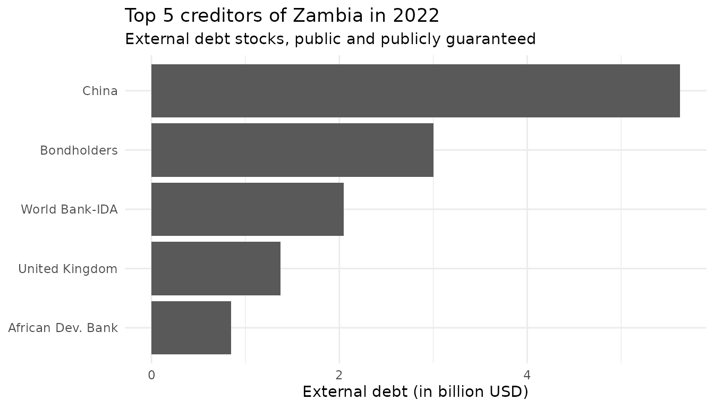

# Using \`wbwdi\` with \`wbids\`

``` r
library(wbwdi)
library(wbids)
library(dplyr)
library(forcats)
library(ggplot2)

theme_set(theme_minimal())
```

The `wbwdi` packages focuses on providing access to World Bank
Development Indicators (WDI), which focus on observations per entity and
year. The `wbids` package, on the other hand, provides access to
International Debt Statistics (IDS), which are available by entity,
counterpart, and year. However, both packages have a shared design
philosophy in order to work seamlessly together.

In the following examples, we’ll focus on Zambia (ISO-3 country code
“ZMB”). Let us first start by visualizing the total external debt (IDS
series “DT.DOD.DPPG.CD”) and central government debt of of Zambia over
time. Since the IDS data is typically in USD, we calculate the latter by
combining central government debt as a % of GDP (“GC.DOD.TOTL.GD.ZS”)
with GDP in USD (“NY.GDP.MKTP.CD”).

``` r
# Set range to 10 years
start_year <- 2013
end_year <- 2022

# Fetch total government in USD via GDP
government_debt <- wdi_get(
  "ZMB",
  c("NY.GDP.MKTP.CD", "GC.DOD.TOTL.GD.ZS"),
  start_year,
  end_year,
  format = "wide"
)

government_debt <- government_debt |>
  mutate(
    debt = `GC.DOD.TOTL.GD.ZS` / 100 * `NY.GDP.MKTP.CD`,
    type = "Government"
  ) |>
  select(entity_id, year, debt, type)

# Fetch total external debt in USD
external_debt <- ids_get(
  "ZMB",
  "DT.DOD.DPPG.CD",
  "all",
  start_year,
  end_year
)

# Counterpart "WLD" indicates whole world
debt_levels <- external_debt |>
  filter(
    counterpart_id == "WLD"
  ) |>
  select(entity_id, year, debt = value) |>
  mutate(type = "External Debt") |>
  bind_rows(government_debt)

# Visualize debt levels
debt_levels |>
  ggplot(aes(x = year, y = debt / 1e9, color = type)) +
  geom_line() +
  labs(
    x = NULL,
    y = "Debt Stock (in billion USD)",
    color = NULL,
    title = "Total Government and External Debt in Zambia"
  )
#> Warning: Removed 1 row containing missing values or values outside the scale range
#> (`geom_line()`).
```


The great thing about IDS is that it allows for breakdown of external
debt by creditor, as the next figure shows.

``` r
# Enrich external debt with counterpart names
debt_breakdown <- external_debt |>
  filter(
    counterpart_id != "WLD" & year == 2022
  ) |>
  left_join(
    ids_list_counterparts(),
    join_by(counterpart_id)
  )

debt_breakdown |>
  arrange(-value) |>
  slice(1:5) |>
  ggplot(aes(x = value / 1e9, y = fct_reorder(counterpart_name, value))) +
  geom_col() +
  labs(
    x = "External debt (in billion USD)",
    y = NULL,
    title = "Top 5 creditors of Zambia in 2022",
    subtitle = "External debt stocks, public and publicly guaranteed"
  )
```



For more applications and insights into international debt, see [Teal
Insights’ Guide to Working with the World Bank International Debt
Statistics](https://teal-insights.github.io/teal-insights-guide-to-wbids/).
