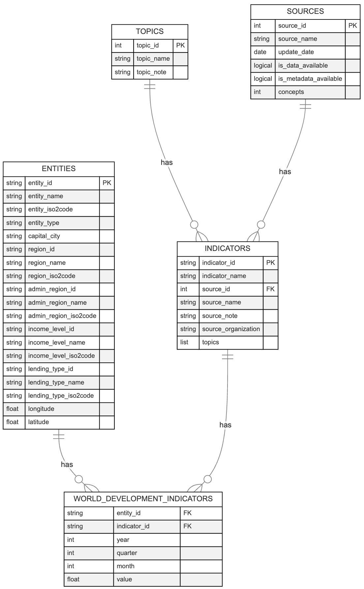

## Overview

The diagram below shows the data model of the `wbwdi` package. In our design, we primarily have R users in mind, particularly those who rely heavily on the popular data manipulation packages `dplyr` and `data.table`. For these users, having consistent and descriptive primary key column names across different tables (e.g., `entity_id`, `series_id`) simplifies writing joins across tables, reduces the risk of column name conflicts, and avoids ambiguity. For more information on the design philosophy, we refer to [econdataverse.org](https://www.econdataverse.org/).

```{r, out.width = "100%", echo=FALSE, fig.alt = "A visual representation of the data model behind the 'wbwdi' R package."}

```

<!-- ```{mermaid} -->
<!-- erDiagram -->
<!--   ENTITIES ||--o{ WORLD_DEVELOPMENT_INDICATORS : has -->
<!--   ENTITIES { -->
<!--     string entity_id PK -->
<!--     string entity_name -->
<!--     string entity_iso2code -->
<!--     string entity_type -->
<!--     string capital_city -->
<!--     string region_id -->
<!--     string region_name -->
<!--     string region_iso2code -->
<!--     string admin_region_id -->
<!--     string admin_region_name -->
<!--     string admin_region_iso2code -->
<!--     string income_level_id -->
<!--     string income_level_name -->
<!--     string income_level_iso2code -->
<!--     string lending_type_id -->
<!--     string lending_type_name -->
<!--     string lending_type_iso2code -->
<!--     float longitude -->
<!--     float latitude -->
<!--   } -->
<!--   INDICATORS ||--o{ WORLD_DEVELOPMENT_INDICATORS : has -->
<!--   INDICATORS { -->
<!--     string indicator_id PK -->
<!--     string indicator_name -->
<!--     int source_id FK -->
<!--     string source_name -->
<!--     string source_note -->
<!--     string source_organization -->
<!--     list topics -->
<!--   } -->
<!--   TOPICS ||--o{ INDICATORS : has -->
<!--   TOPICS { -->
<!--     int topic_id PK -->
<!--     string topic_name -->
<!--     string topic_note -->
<!--   } -->
<!--   SOURCES ||--o{ INDICATORS : has -->
<!--   SOURCES { -->
<!--     int source_id PK -->
<!--     string source_name -->
<!--     date update_date -->
<!--     logical is_data_available -->
<!--     logical is_metadata_available -->
<!--     int concepts -->
<!--   } -->
<!--   WORLD_DEVELOPMENT_INDICATORS { -->
<!--     string entity_id FK -->
<!--     string indicator_id FK -->
<!--     int year -->
<!--     int quarter -->
<!--     int month -->
<!--     float value -->
<!--   } -->
<!-- ``` -->

## Table details

### entities

| Column name | Description | Example value |
|------------------|------------------------------------|------------------|
| entity_id | Unique identifier for the entity | ZMB |
| entity_name | Standardized name of the entity | Zambia |
| entity_iso2code | ISO 3166-1 alpha-2 code of the entity | ZM |
| entity_type | Type of entity (country, aggregate) | country |
| capital_city | Capital city of the entity | Lusaka |
| region_id | Unique identifier for the region | SSF |
| region_name | Name of the region | Sub-Saharan Africa |
| region_iso2code | ISO 3166-1 alpha-2 code of the region | ZG |
| admin_region_id | Unique identifier for the administrative region | SSA |
| admin_region_name | Name of the administrative region | Sub-Saharan Africa (excluding high income) |
| admin_region_iso2code | Unique identifier for the administrative region | ZF |
| income_level_id | Unique identifier for the income level | LMC |
| income_level_name | Name of the income level | Lower middle income |
| income_level_iso2code | ISO code of the income level | XN |
| lending_type_id | Unique identifier for the lending type | IDX |
| lending_type_name | Name of the lending type | IDA |
| lending_type_iso2code | ISO code of the lending type | XI |
| longitude | Longitude of the entity | 28.2937 |
| latitude | Latitude of the entity | -15.3982 |

### Indicators

| Column name | Description | Example value |
|------------------|--------------------|----------------------------------|
| indicator_id | Unique identifier for the indicator | DT.DOD.DPPG.CD |
| indicator_name | Name of the indicator | External debt stocks, public and publicly guaranteed (PPG) (DOD, current US\$) |
| source_id | Unique identifier for the data source | 2 |
| source_name | Name for the data source | World Development Indicators |
| source_note | Note about the data source | Public and publicly guaranteed debt comprises long-term external obligations of public debtors, including the national government, Public Corporations, State Owned Enterprises, Development Banks and Other Mixed Enterprises, political subdivisions (or an agency of either), autonomous public bodies, and external obligations of private debtors that are guaranteed for repayment by a public entity. Data are in current U.S. dollars. |
| source_organization | Organization responsible for the data series | World Bank, International Debt Statistics. |
| topics | List of topics with ID and corresponding name | (20, External Debt) |

### Topics

| Column name | Description | Example value |
|------------------|--------------------|----------------------------------|
| topic_id | Unique identifier for the topic | 1 |
| topic_name | Name of the topic | Agriculture & Rural Development |
| topic_note | Note about the topic | For the 70 percent of the world's poor who live in rural areas, agriculture is the main source of income and employment. But depletion and degradation of land and water pose serious challenges to producing enough food and other agricultural products to sustain livelihoods here and meet the needs of urban populations. Data presented here include measures of agricultural inputs, outputs, and productivity compiled by the UN's Food and Agriculture Organization. |

### Sources

| Column name | Description | Example value |
|------------------|--------------------|----------------------------------|
| source_id | Unique identifier for the source | 1 |
| source_name | Name of the source | Doing Business |
| update_date | Date with last update | 2021-08-18 |
| is_data_available | Indicator whether data is available | TRUE |
| is_metadata_available | Indicator whether metadata is available | TRUE |
| concepts | Number of concepts in the source | 3 |

### World Development Indicators

| Column name  | Description                  | Example value  |
|--------------|------------------------------|----------------|
| entity_id | Identifier for the entity | USA            |
| indicator_id | Identifier for the indicator | DT.DOD.DPPG.CD |
| year         | Year of the data point       | 2020           |
| quarter      | Quarter of the data point (if quarterly data is requested and available).      | 3           |
| month         | Month of the data point (if monthly data is requested and available).    | 2020         1  |
| value        | Value of the data point      | 4298957000     |
